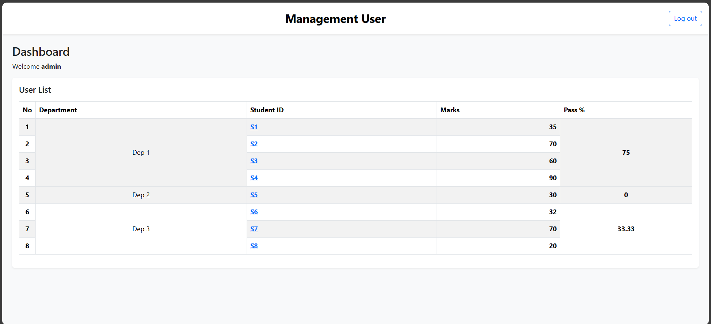

# MINI Dashboard User APP

MINI Dashboard User APP is a web-based application built with Java Servlet Pages for the Front End. The application is designed to monitor students .


## Tech Stack

**Client:** Java, JSP, JQuery, Bootstrap, Tomcat 10, maven


## Features Client

- Login Page
- Dashboard Student Page

## Installation

Clone Project Repository

```bash
  git clone https://github.com/Myudhaap/JASP-project.git
```

## Dummy User
userId: admin

password: 12345

## Demo

Dashoard


Sidebar


Employee


## License

[Github: @Myudhaap](https://github.com/Myudhaap)

